PetHealth is a patient management software with a goal to provide enhanced collaboration between veterinary medicine practitioners.

Through shared access to patient records, we want to create meaningful cooperation and dialog in the field,
to improve patient care and bring up to date diagnostics to the forefront of the daily procedures.

## Introduction

Hi, I'm Ott and I want to present to you why we built PetHealth and why we think that improving collaboration in veterinary medicine is important.

First of all, I want to introduce our amazing team, that we assembled in the Student Startup Camp 2019 that was held in Tartu.

Kaarel Loide - front-end developer,
Aksel Jänes - designer,
Kustas Budrikas - designer,
Anette Kuklane - business and marketing,
Aysen Suleymanova - front-end developer,
Kertrud Järg - analyst and product management,
Ott Tooming - team lead and full-stack developer

All of us are students and continuing our education in various disciplines,
ranging from "Media and Advertisement Design" in Pallas University of Applied Sciences to "Web technologies" in Estonian Entrepreneurship University of Applied Sciences.

<MasonryGallery>

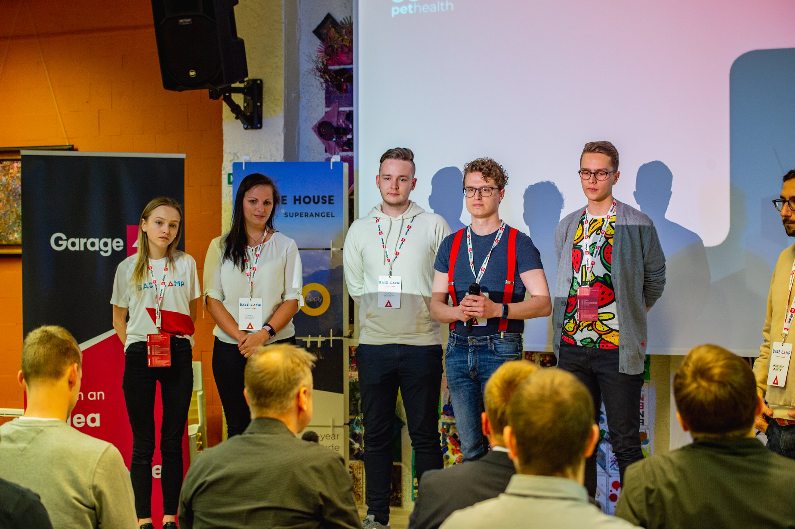

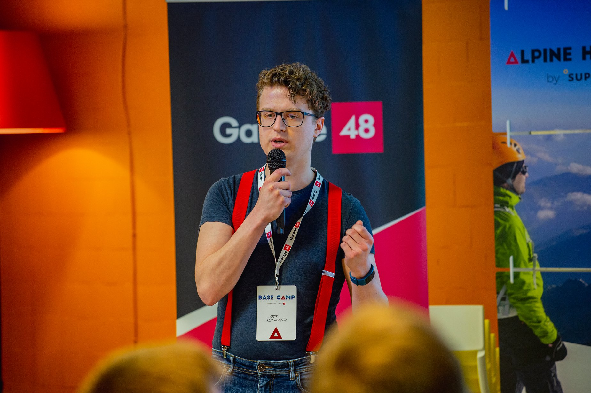

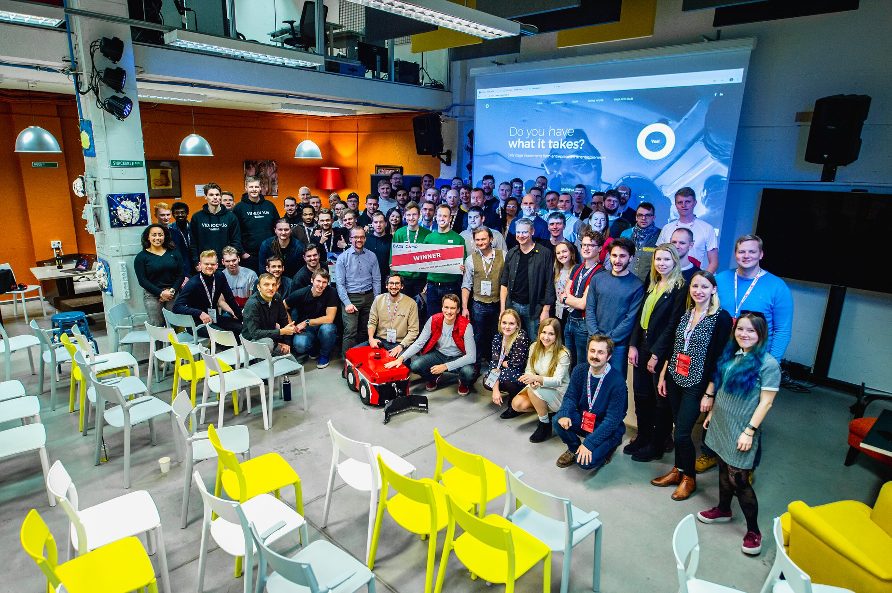

</MasonryGallery>

Our amazing team got it's wings in the Student Startup Camp 2019 where we won the ["Best Design Special Award"](http://ideelabor.ut.ee/news/student-startup-camp-2019-winners-are-here).

Then we were shortlisted for the Garage48 Base Camp Spring 2019 hackathon where we also got directed by an amazing group of mentors ["Base Camp Vol.2 Magnifies the Entire Hackathon Experience"](http://garage48.org/blog/base-camp-vol-2-magnifies-the-entire-hackathon-experience).

We are enthusiastic about our field but also have had strong experience in the wider SaaS industry while working for Pipedrive, Voog and various smaller companies.

## What are we solving

Our platform is dedicated to providing a solution that empowers and enhances animal healthcare through collaboration between veterinary doctors.

We want to reduce the barrier for veterinarians to communicate their diagnostic requirements.
In doing so, this will unleash the true potential for vets to concentrate on the patient and offer them the best available care they can provide.

And, beyond the specific facilitation, we believe it can usher in a greater understanding of the medical conditions veterinarians are faced daily.
We see tremendous potential in collating patient records and applying analytical oversight over the materials in future diagnostic quality.

## How it works

Traditional patient management systems restrict you to work in isolation and hope for the best.
You can in many instances forward your records through email and other methods, but you'd get every response in your inbox, outside your records, but most certainly outside of your internal flow.
With this approach, you can easily descend into chaos with back and forth chatter.

Our goal is to bring this closed circle to open and enable access to patient records based on your requirements and needs.
Through our service veterinarians can assign access to specific records with redacted or full detail listing.
With a convenient patient timeline view and a communication threading availability in your fingertips.

It is a central thesis that collaboration should be as accessible and informative as possible.
Including the solutions presented so far, we would expect to significantly transform the modern needs of veterinary practitioners.
Increasing productivity, diagnostic speed, and patient wellbeing.

## Existing solutions

Current established practices and solutions in the market do not adequately enable full potential in communicating patient diagnosis.
This in itself restricts effective patient care that could be delivered.

While there are a plethora of solutions on the market offering patient management systems, all of them are limited to a silo for a specific clinic
and don't tap into the collaborative potential of the field.

Currently, no software in the market allows both shared communication and shared access to the patient medical history between different institutions.

On the other hand, creating a platform from the ground up to facilitate consultations and shared record as a first-class citizen,
we will connect veterinarians to their colleagues in the field.

### Email as a collaboration tool

Looking more closely to existing solutions used by veterinarians, then the most common way that written information is forwarded currently involves email,
where there are obvious flaws when used as a collaboration tool.

<PieChart
  data={[
    { name: "E-mail", value: 264 },
    { name: "Groups and forums", value: 194 },
    { name: "Phone", value: 333 },
    { name: "Social media", value: 181 },
    { name: "Else", value: 28 },
  ]}
  info="Research questionnaire for veterinarians in Estonian sent out for Student Startup Camp 2019"
/>

Sharing information between multiple participants in this fashion is especially hamstrung by the need to keep an constant eye on the updated patient records that can change dynamically,
without the ability to alter previous records.
This creates a neverending flood of redundant updates, hindering the tracking of patient situation and diagnostic status.

Other factors in restricting user flows include the lack of conveniet way to include new participants, without CC'ing a giant list.
Tacking a conversation in a thread to private is cumbersome and creates a new flow of discrepancy between patient records that need constant observation.

### Separate channels as a disjointed experience

In current situation there are plethora of different channels to find information and ask for counsel if there is a patient that needs a diagnostic consultation.
This creates a situation that you are left asking "Did I send it as email", "Was it in Slack", "Did I create a post for it?" etc.
While inconvenient it is also a major hindrance on productivity, necessitating redundant information duplication and handling with platform shortcomings.

## Current market

Veterinary healthcare is a stable and continuous market both in Estonia and the rest of the world.
In Estonia alone, there are approximately 90 small-animal clinics, from 1 up to 20 veterinary doctors per clinic.
Respectively the market in Finland is four to five times bigger and the US market being closer to eighty times bigger than the Estonian market.

In respect to sharing information and handling consultations, there is already an established practice for routine cooperation.

<PieChart
  data={[
    { name: "Shared mostly with acquaintances", value: 375 },
    { name: "Sometimes not shared at all", value: 281 },
    { name: "Only when needed", value: 219 },
    { name: "Shared with everyone", value: 63 },
    { name: "Shared often", value: 63 },
  ]}
  info="Research questionnaire for veterinarians in Estonian sent out for Student Startup Camp 2019"
/>

From initial interviews with veterinarians and technicians, it is understood that the lack of more intricate solutions in the market is hindering more communication in the field.
Hence reducing the quality and quantity of veterinary healthcare in general.

## Our target group

Our target group of users is small to medium-sized clinics and educational institutions.
We want to provide them with a replacement for their existing patient management system or an augmented solution to improve their service quality.

Educational market is one of our main goals in part due to the value proposition we can provide to starting students.
It will enable them to coordinate their curricilum mandated internship diagnostics, help in case studies and provide ample resources for perspective scientific research.

## Our objectives

PetHealth will offer an intuitive to use SaaS solution where we strive to create superior value for our customers through a reduction in the length of the diagnostic process.

- Improve and make the work of veterinary doctors efficient and easier
- Enhance the availability, transparency, and quality of veterinary medicine
- Provide a platform for learning for younger doctors and a platform for continuous learning for experienced professionals

## Our keys to success

- Intuitive to use and efficient service that will build and maintain customer loyalty
- Strong market connections and relationships with educational institutions
- Unique selling point - providing software currently not existing in its specific niche
- Our commitment to providing improved diagnostic quality and continuous improvement in record analytics

## Technical implementation

For the technical side, we use React and Node.js microservices approach. Powered by the amazing Prisma Client and GraphQL API we can rapidly iterate to validate our business idea.
We want to keep our stack as accessible and lean as possible to handle domain-specific necessities rapidly.

Having long term experience with JavaScript/TypeScript ecosystem, we have great confidence in our ability to fulfill the best in ourselves and strive to deliver the best experience to our users.

## Prototype

Our completed MVP prototype was launched in Student Startup Camp and we iterated on the idea during the Alpine House Base Camp by adding specific medical condition view support.
This was to enable veterinary doctors to fully concentrate on the specific diagnostic condition and request collaboration from other professionals.

Out of the scope for our initial implementation is rights and account management as we were focused on validating underlying use cases how the customers would interact with the tool.

For current details on implementation, we present our design concepts and an elemental demonstration at [PetHealth.ee](https://pethealth.ee)

<MasonryGallery>

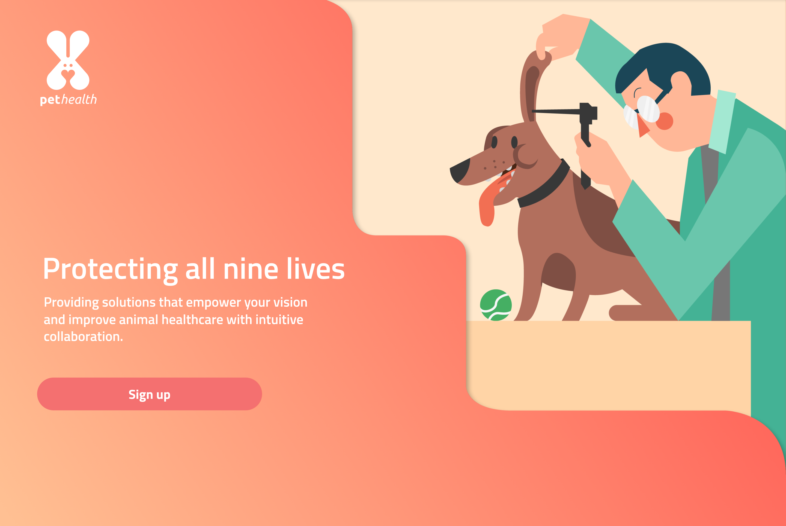

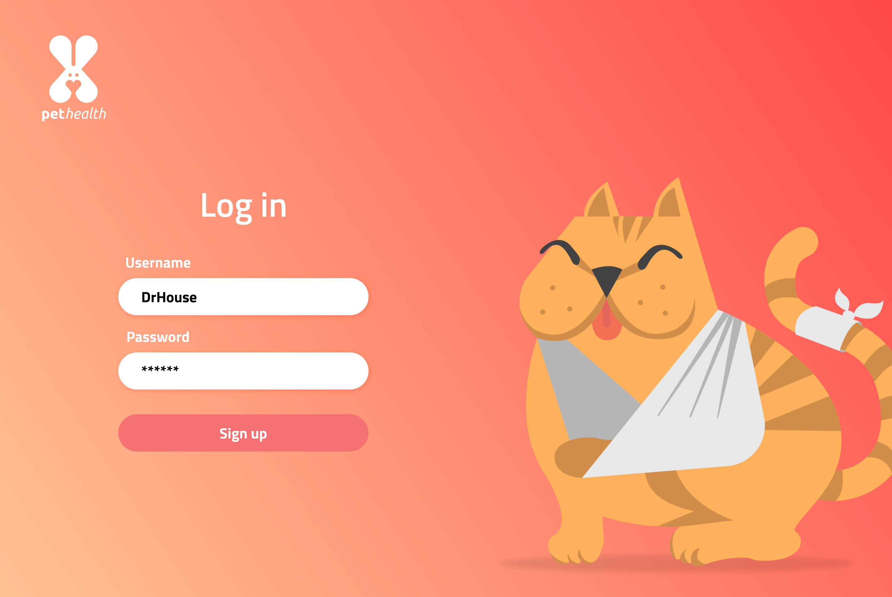

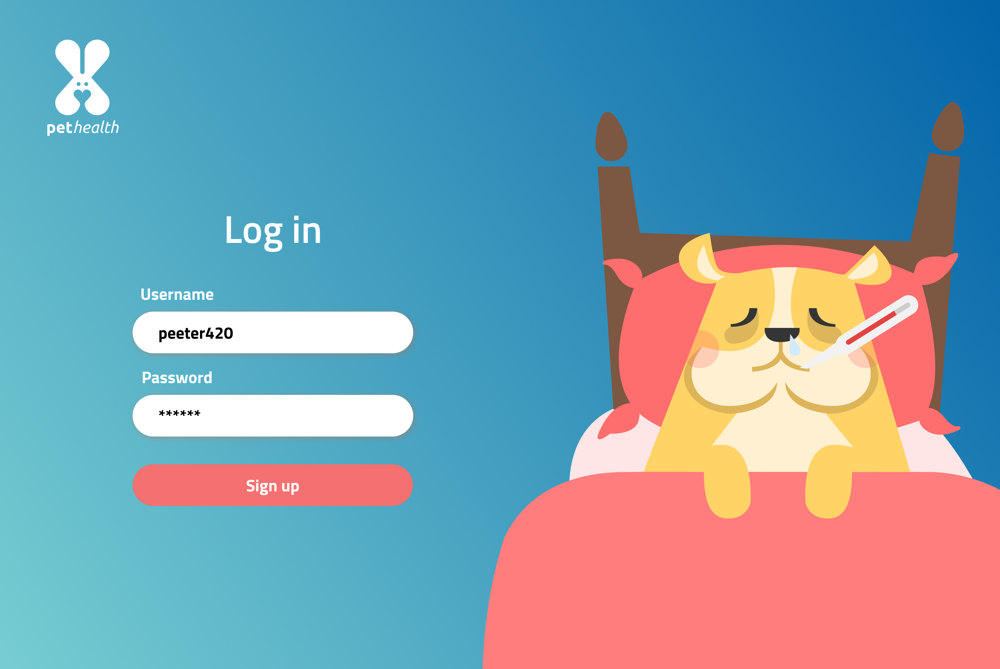

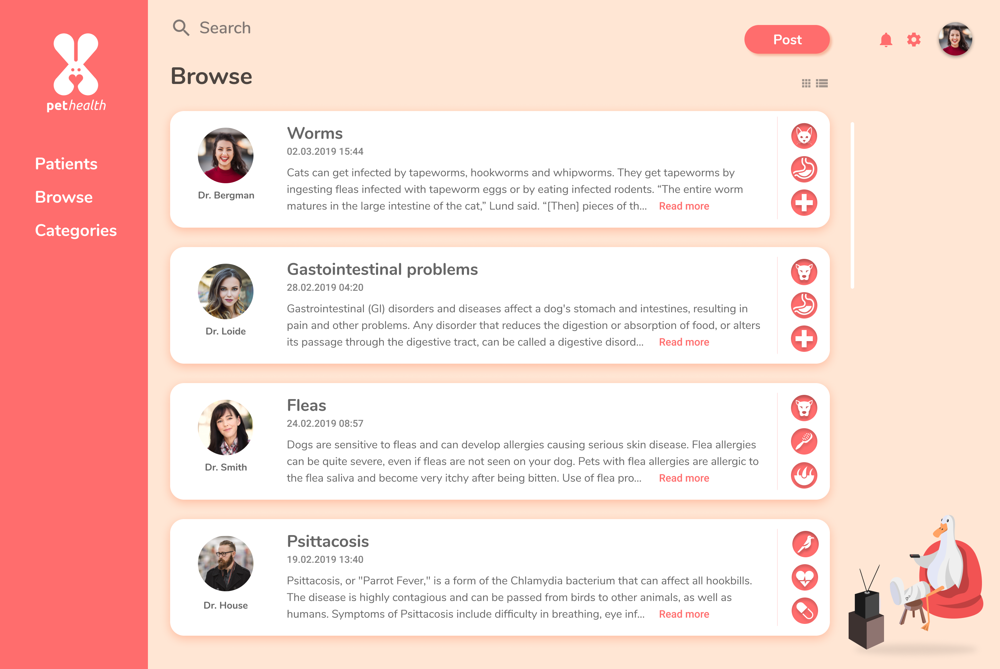

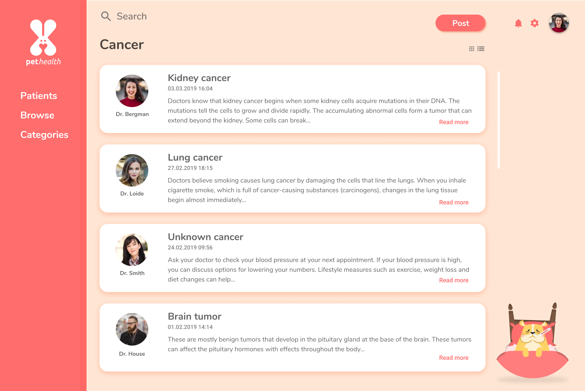

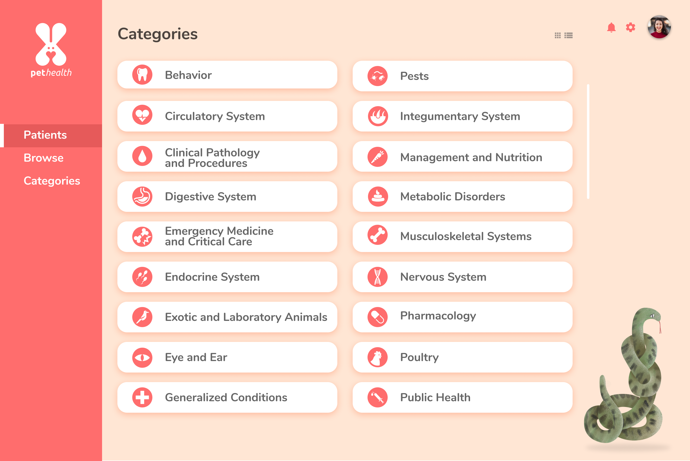

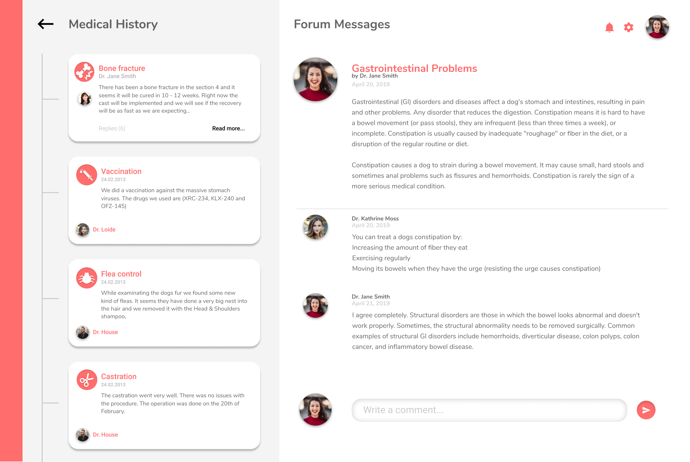

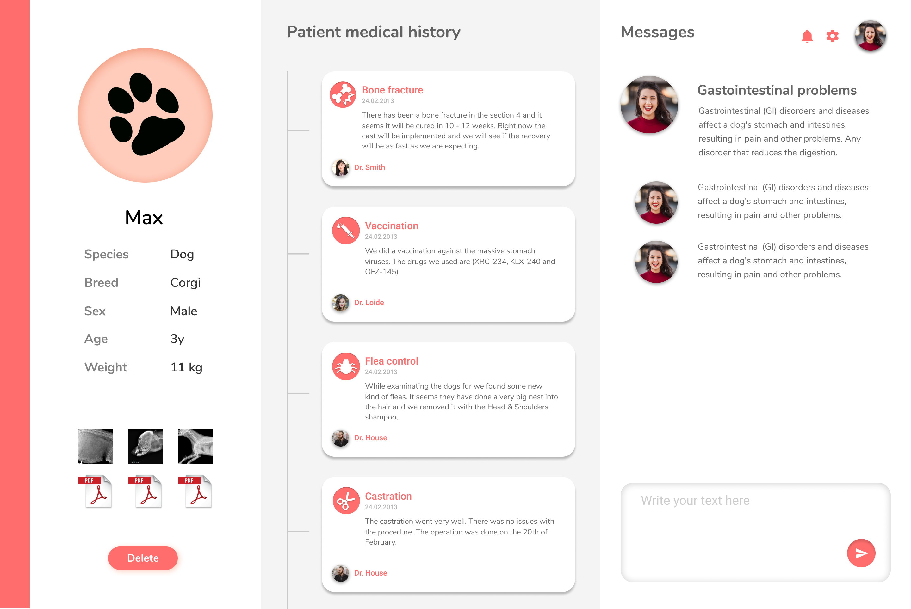

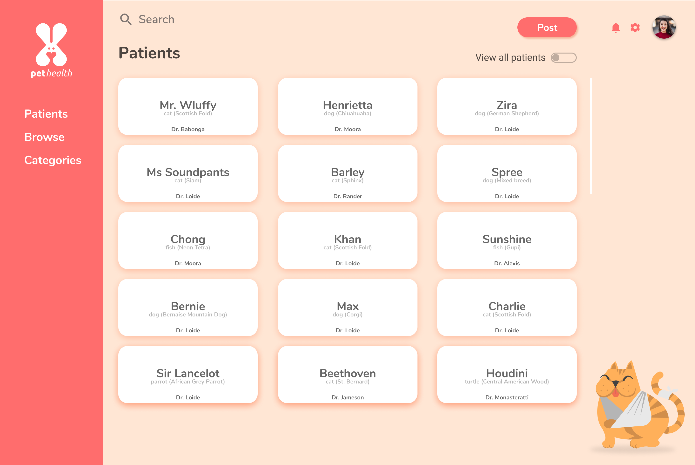

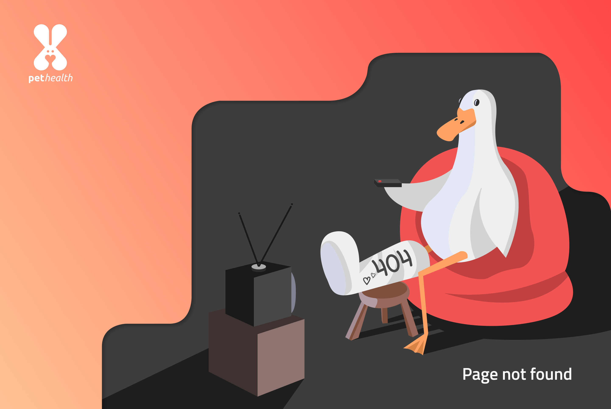

</MasonryGallery>
