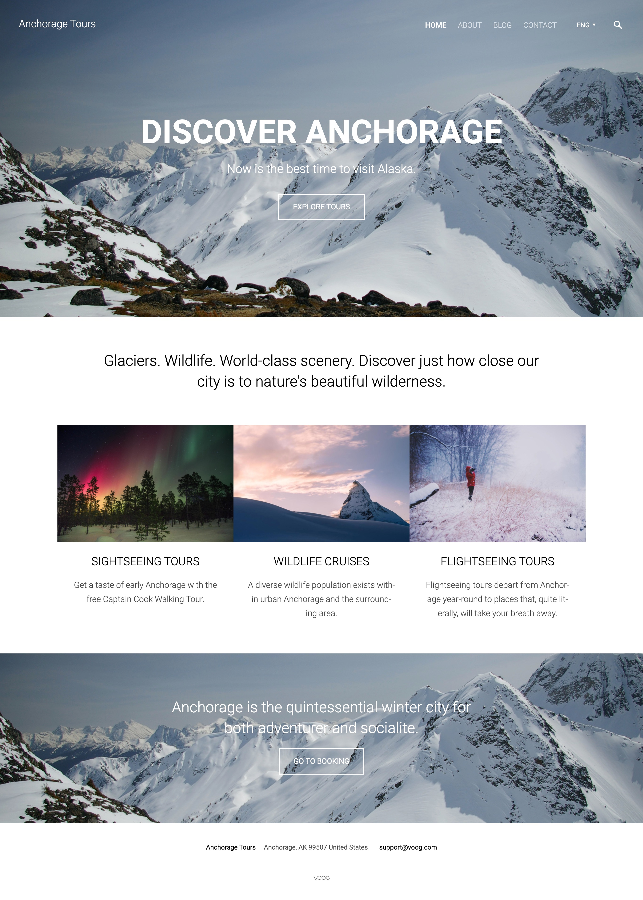
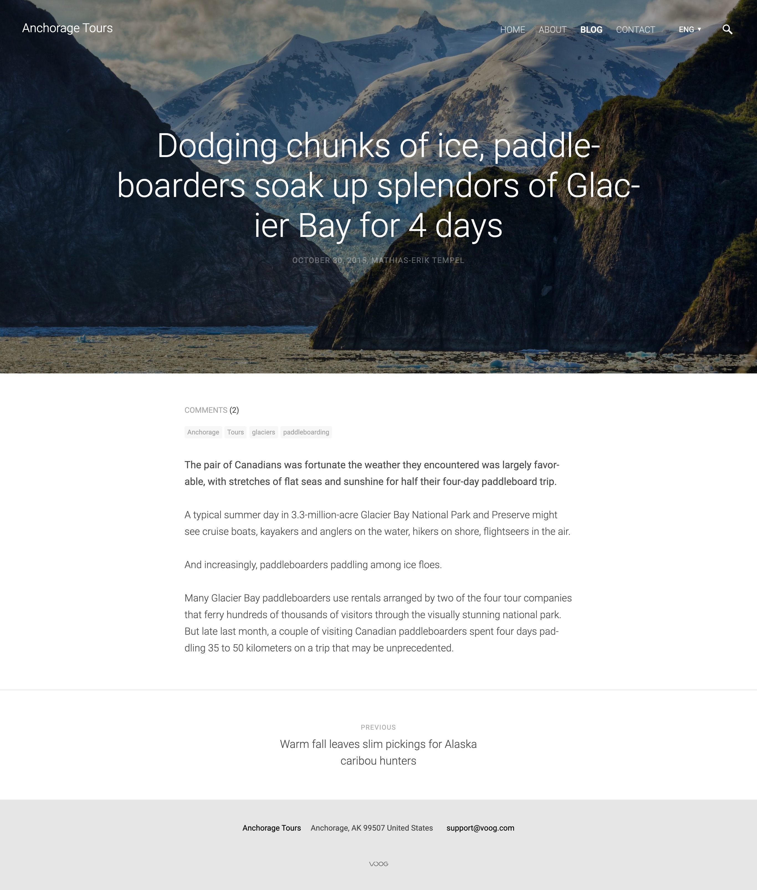
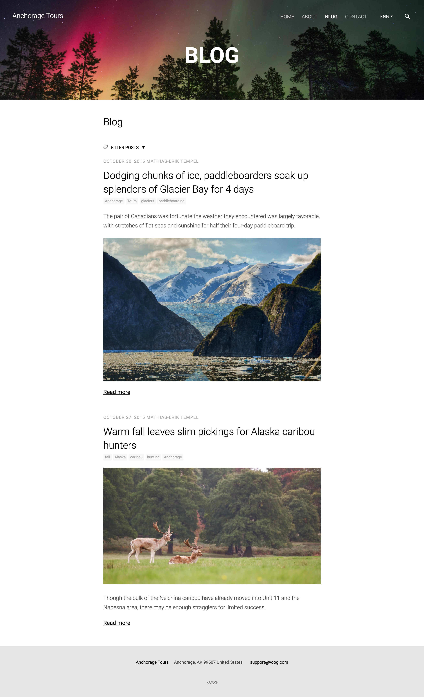
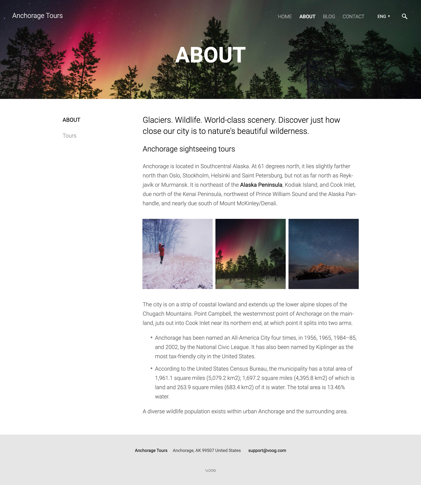
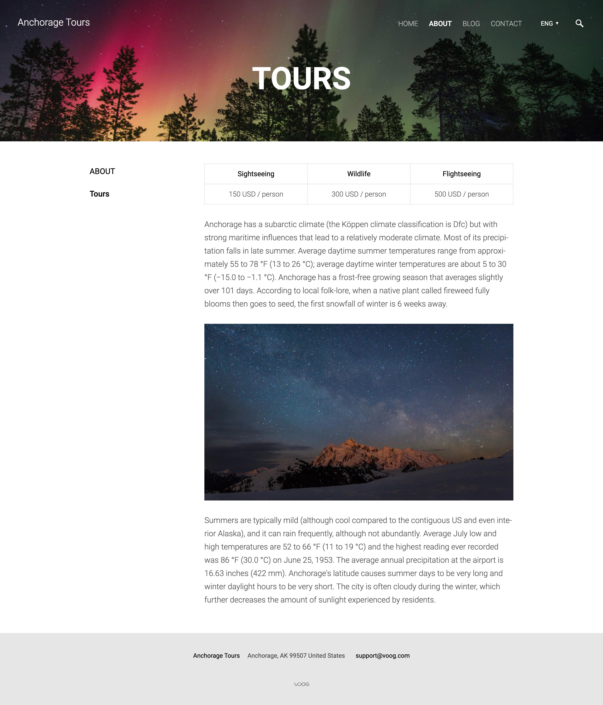
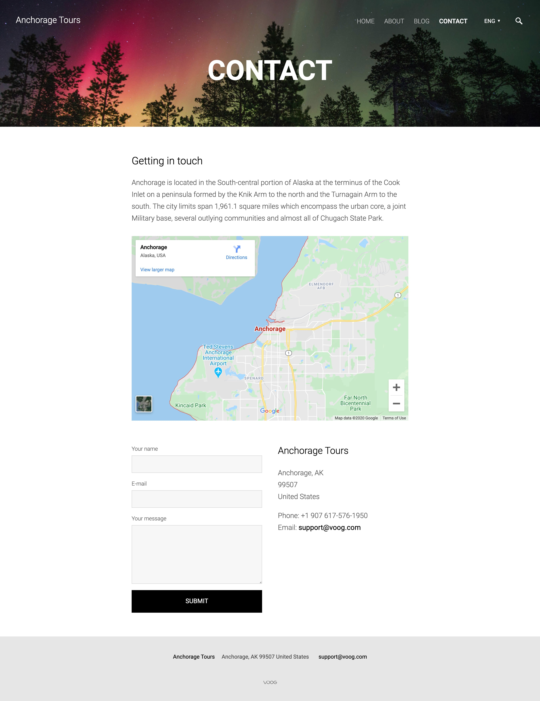

## About

Modern template for [Voog CMS](/projects/voog-cms) with a long front page that plays well with visually loaded content.

## Summary

This was my first project handling a complete template buildup for [Voog](/projects/voog-cms) from the ground up.

Working hand in hand with designers from [Fraktal](https://fraktal.co/) to realize best customizable and dynamic design considerations for the [Voog](/projects/voog-cms) platform.

<MasonryGallery>

</MasonryGallery>
