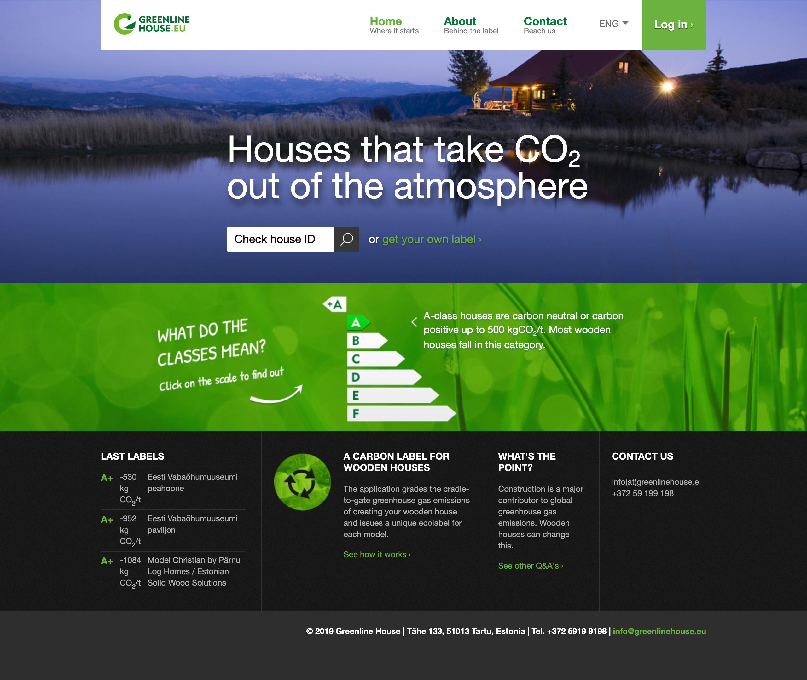
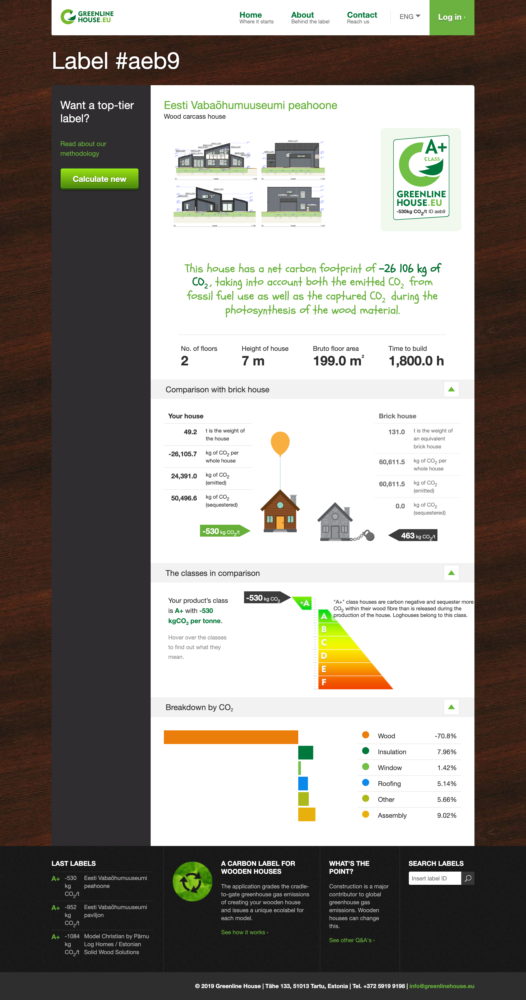
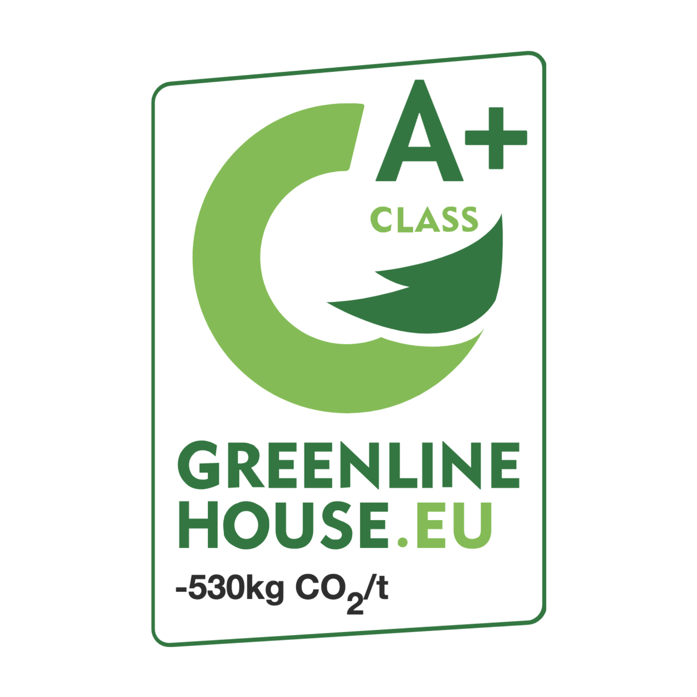

Greenline House is a carbon footprint labeling tool for wooden houses. We worked on creating an updated dashboard and data entry system for the project.
While also improving site layout, templating system, and responsiveness for mobile users.

Personal effort concentrated mainly on the transformation of design assets to working templates for Voog CMS while working together with designers to improve responsive capabilities of the visual layout.

<MasonryGallery>

</MasonryGallery>
