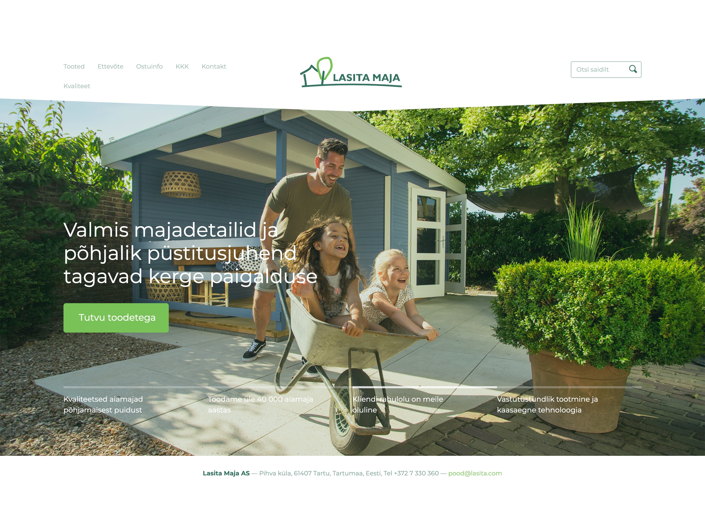
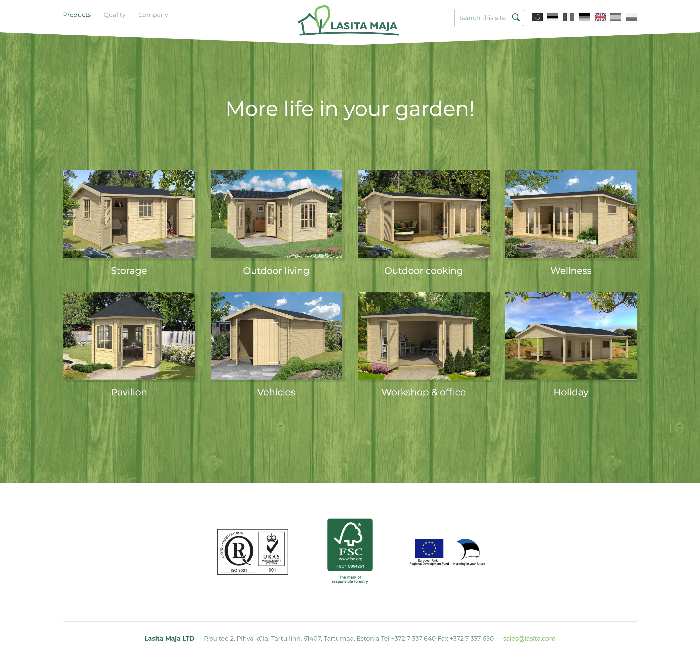
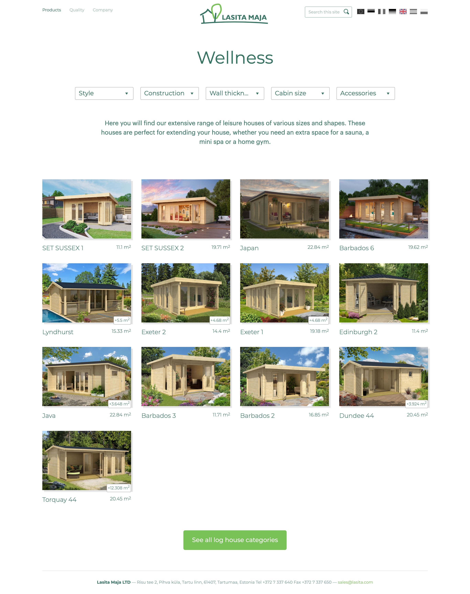
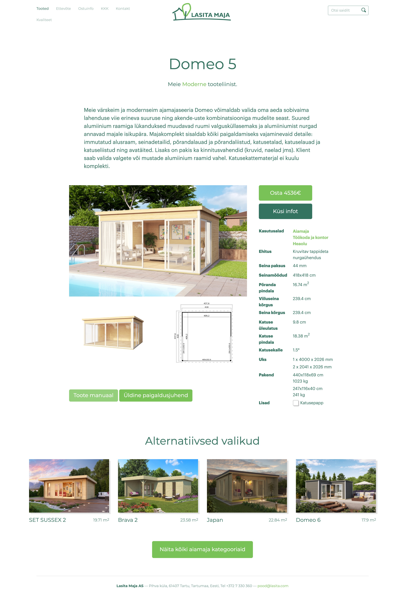
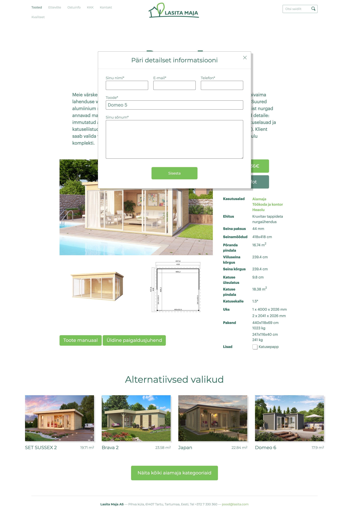
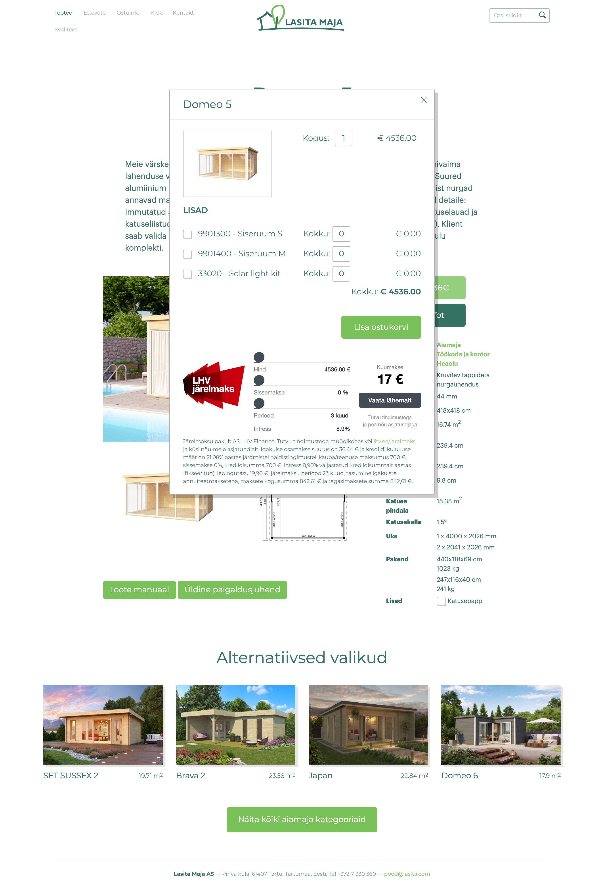
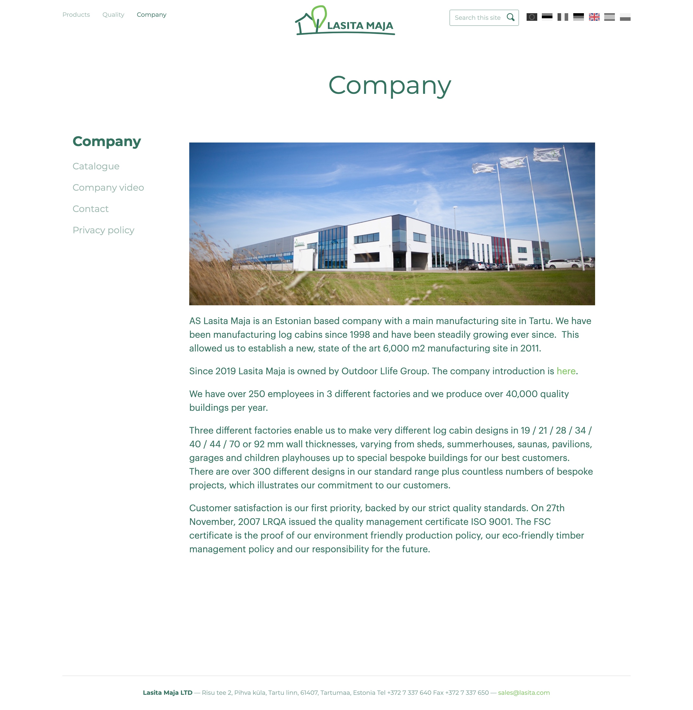
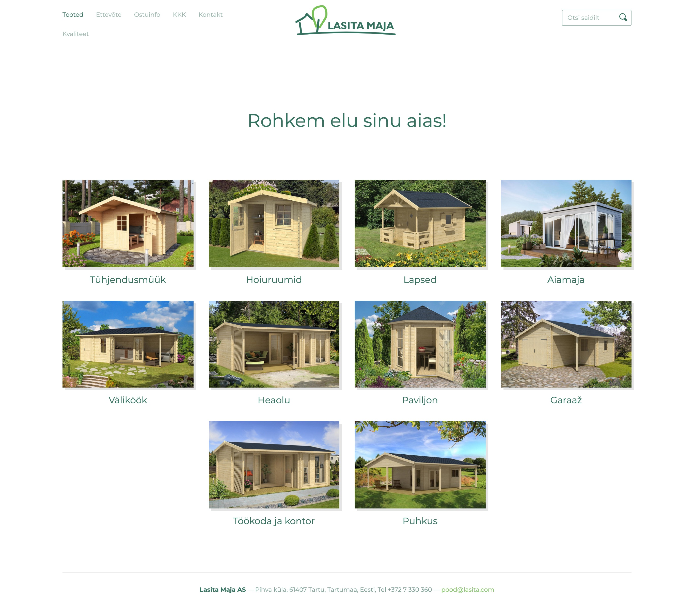
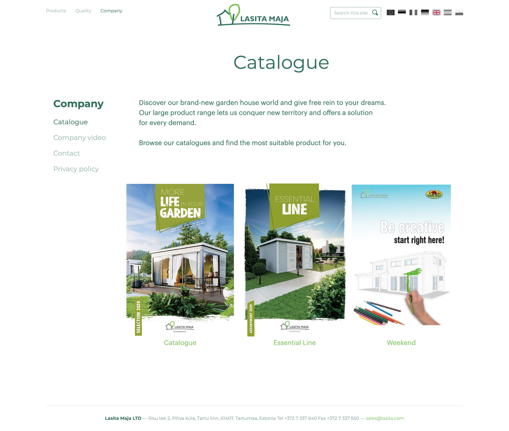

## About

Lasita is an Estonian timber building manufacturer that specializes in producing small modular houses and utility structures.

## Summary

We were tasked with developing a brand new web presence for the client that would encompass both the company catalog and the e-commerce implementations.

My task was focused on building a new company website from the ground up and organize an e-commerce presence utilizing the Voog CMS.

The main considerations were to complete the design layout to work with all the dynamic aspects of the CMS platform while maintaining visual coherency.

Working actively together with designers to include optimal consideration for responsive layouts and content management possibilities. To maximize client expectations and ensure the best user experience.

<MasonryGallery>

</MasonryGallery>
