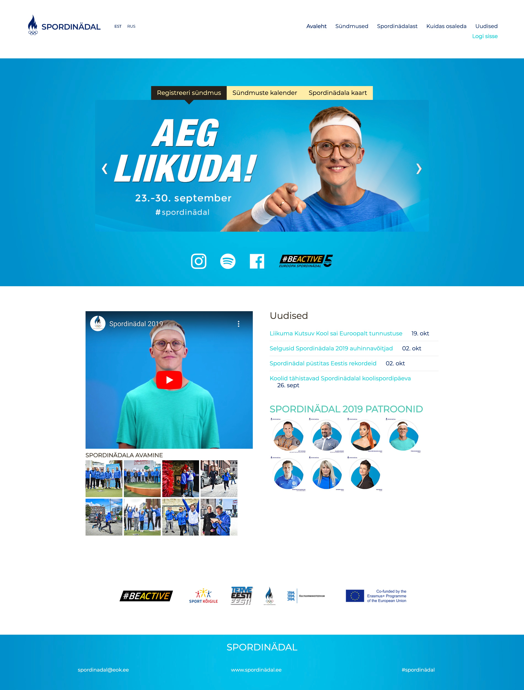
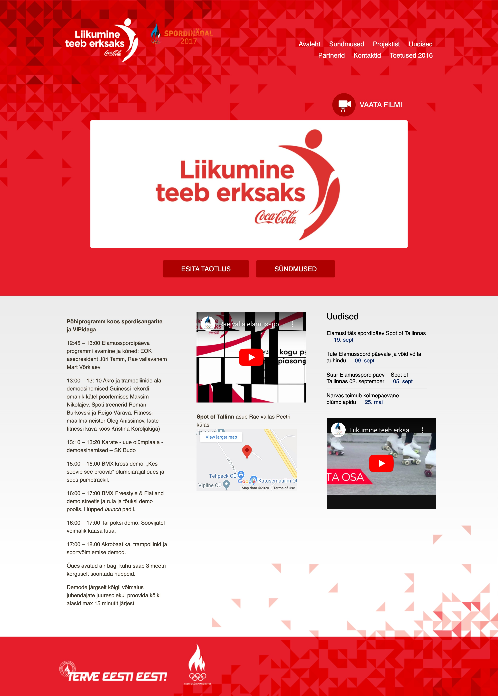
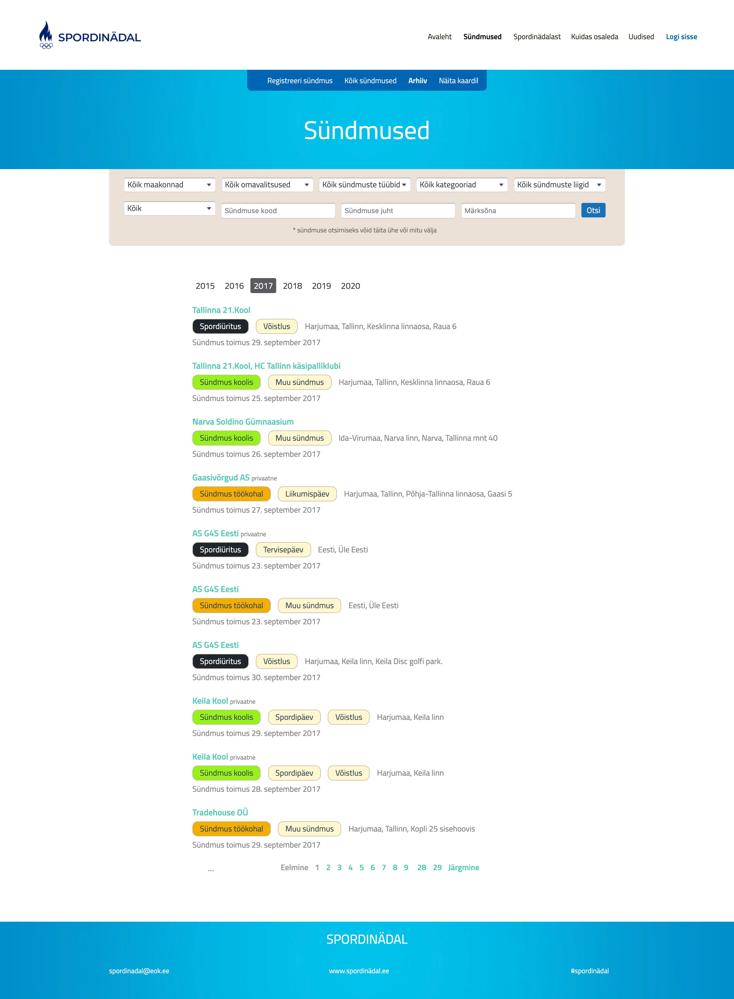
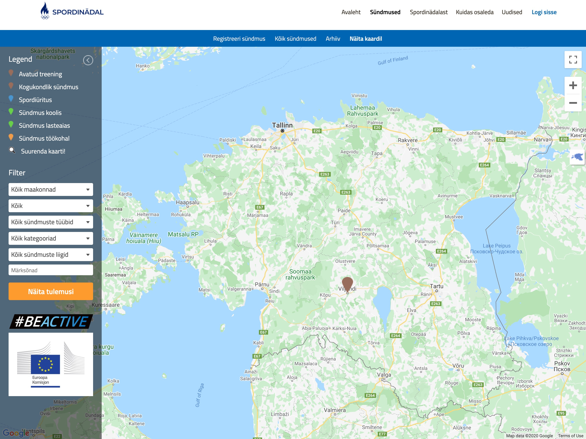

## About

Spordinädal is an Estonian Olympic Committee portal for coordinating various sports-related community events in Estonia during the month of September.
The purpose is to spread active lifestyle habits among the general population and raise awareness about health and fitness.

## Summary

A client project for Spordinädal where we were tasked in porting over a working template from an existing community service that handled event listing and booking solutions.
Separate requirements were related to building new landing pages for special sponsored events and campaigns.

From a technical side, improving template compatibility with Voog CMS and mobile responsiveness.

<MasonryGallery>

</MasonryGallery>
